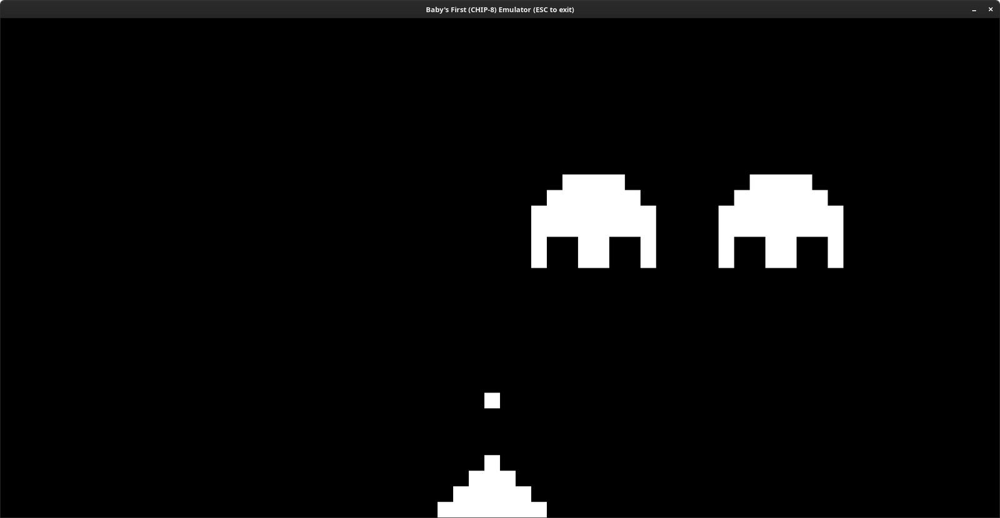
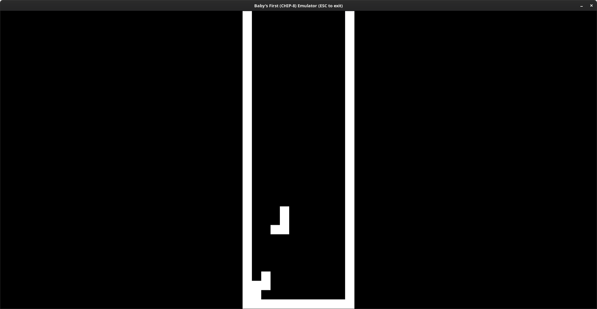
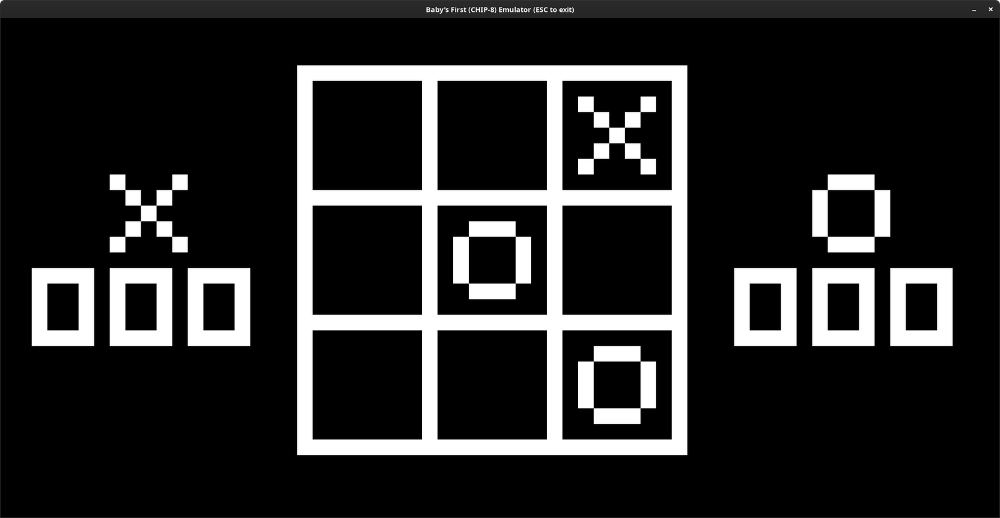

# chip8

Baby's first emulator, of the [CHIP-8](https://en.wikipedia.org/wiki/CHIP-8)
variety. (The NES was a wee bit daunting for a first emulator project.)

Hacked together in Rust.

## Usage

```
$ cargo run --release roms/ROM_NAME
```

## Screenshots







## Known issues

* No sound. (It's monotone anyway, so no huge loss.)
* Not cycle-accurate.

## References

* [Cowgod's CHIP-8 Technical Reference v1.0](http://devernay.free.fr/hacks/chip8/C8TECH10.HTM).
* [aymanbagabas/C8emu](https://github.com/aymanbagabas/C8emu).
* [`minifb`](https://docs.rs/minifb/0.15.1/minifb/).
